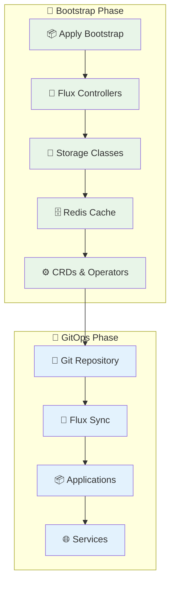
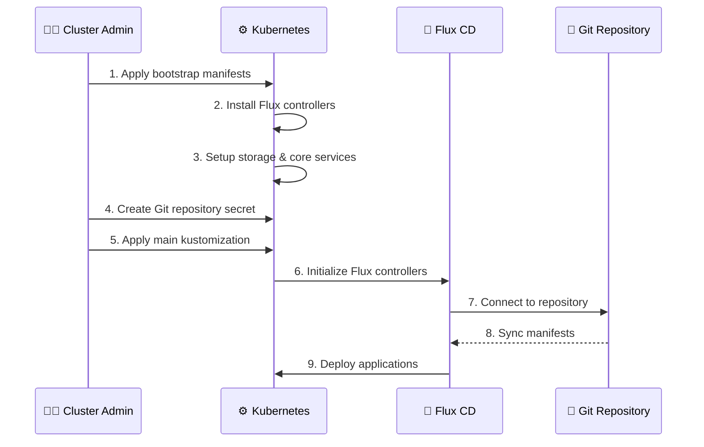
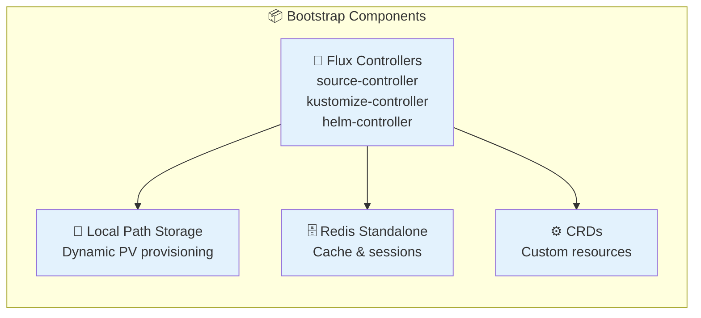

# 🚀 Bootstrap Infrastructure

This directory contains the foundational components needed to bootstrap a Kubernetes cluster with GitOps capabilities using Flux CD.

## 📋 Table of Contents

- [🎯 Overview](#-overview)
- [📋 Prerequisites](#-prerequisites)
- [🛠️ Bootstrap Process](#️-bootstrap-process)
- [🔧 Components](#-components)
- [✅ Verification](#-verification)
- [🐞 Troubleshooting](#-troubleshooting)

## 🎯 Overview

The bootstrap process establishes the core infrastructure foundation that enables GitOps workflows:



## 📋 Prerequisites

Before starting the bootstrap process, ensure you have:

### ☁️ Infrastructure Requirements

- ✅ **Running Kubernetes cluster** (K3s, EKS, GKE, etc.)
- ✅ **Cluster admin access** with valid kubeconfig
- ✅ **Persistent storage** capability

### 🛠️ Development Tools

Install via [mise](https://mise.jdx.dev/) (automatically configured):

- 🔄 `flux2` - GitOps operator CLI
- ⚙️ `kubectl` - Kubernetes CLI
- 🔐 `sops` - Secret encryption tool
- 🔑 `age` - Modern encryption

### 🔐 Authentication & Security

- 🗝️ **SSH deploy key** for Git repository access
- 🔐 **Age encryption key** for SOPS secret management (optional)
- 👤 **Git repository** with appropriate permissions

### 🚦 Quick Prerequisites Check

```bash
# Verify cluster access
kubectl cluster-info

# Check Flux prerequisites
flux check --pre

# Verify tools are installed
kubectl version --client
flux version --client
```

## 🛠️ Bootstrap Process

Follow this step-by-step workflow to initialize your cluster:



### 🔧 Step 1: Apply Bootstrap Configuration

```bash
# Apply core bootstrap components
kubectl apply --kustomize bootstrap
```

This installs:

- 🔄 **Flux CD controllers** (source, kustomize, helm, notification)
- 💾 **Local Path Storage** provisioner
- 🗄️ **Redis** standalone instance
- ⚙️ **Custom Resource Definitions** (CRDs)

### 🔐 Step 2: Configure Git Repository Access

```bash
# Create deploy key secret for GitLab
kubectl create secret generic infra-gitlab-deploy-key \
  --namespace=flux-system \
  --from-file=identity=infra-gitlab-deploy-key \
  --from-file=identity.pub=infra-gitlab-deploy-key.pub \
  --from-literal=known_hosts="$(ssh-keyscan gitlab.topfollowers.com 2>/dev/null)"
```

### 🚀 Step 3: Initialize GitOps Workflow

```bash
# Apply main cluster configuration
kubectl apply -k kubernetes/
```

### ⏱️ Step 4: Wait for Reconciliation

```bash
# Monitor bootstrap progress
watch kubectl get pods -n flux-system

# Check Flux status
flux get all
```

## 🔧 Components

### Core Bootstrap Components



#### 🔄 Flux CD Controllers

- **Source Controller**: Manages Git repositories and Helm charts
- **Kustomize Controller**: Applies Kustomize configurations
- **Helm Controller**: Manages Helm releases
- **Notification Controller**: Sends alerts and notifications

#### 💾 Local Path Storage

- Provides dynamic persistent volume provisioning
- Uses local host paths for storage
- Suitable for development and single-node clusters

#### 🗄️ Redis Standalone

- In-memory data structure store
- Used for caching and session management
- Configured for development workloads

## ✅ Verification

### 🔍 Health Checks

```bash
# Verify Flux installation
flux check

# Check all components are running
kubectl get pods -n flux-system

# Verify storage class
kubectl get storageclass

# Check Redis deployment
kubectl get pods -l app=redis
```

### 📊 Expected Output

**Flux System Pods:**

```
NAME                                       READY   STATUS    RESTARTS
helm-controller-xxx                        1/1     Running   0
kustomize-controller-xxx                   1/1     Running   0
notification-controller-xxx                1/1     Running   0
source-controller-xxx                      1/1     Running   0
```

**Storage Classes:**

```
NAME         PROVISIONER             RECLAIMPOLICY   VOLUMEBINDINGMODE
local-path   rancher.io/local-path   Delete          WaitForFirstConsumer
```

## 🐞 Troubleshooting

### Common Issues & Solutions

#### ❌ Flux Controllers Not Starting

```bash
# Check events
kubectl get events -n flux-system --sort-by='.lastTimestamp'

# Verify RBAC permissions
kubectl auth can-i '*' '*' --as=system:serviceaccount:flux-system:source-controller

# Check controller logs
kubectl logs -n flux-system -l app=source-controller
```

#### ❌ Storage Provisioning Issues

```bash
# Check local-path-provisioner
kubectl get pods -n local-path-storage

# Verify node capacity
kubectl describe nodes

# Test PVC creation
kubectl apply -f - <<EOF
apiVersion: v1
kind: PersistentVolumeClaim
metadata:
  name: test-pvc
spec:
  accessModes: ["ReadWriteOnce"]
  resources:
    requests:
      storage: 1Gi
  storageClassName: local-path
EOF
```

#### ❌ Git Repository Connection Issues

```bash
# Test SSH connectivity
kubectl exec -n flux-system deploy/source-controller -- \
  ssh -T git@gitlab.topfollowers.com

# Check deploy key secret
kubectl get secret infra-gitlab-deploy-key -n flux-system -o yaml

# Verify known_hosts
kubectl get secret infra-gitlab-deploy-key -n flux-system \
  -o jsonpath='{.data.known_hosts}' | base64 -d
```

### 🔄 Recovery Procedures

**Complete Bootstrap Reset:**

```bash
# Remove all Flux components
kubectl delete namespace flux-system

# Remove storage components
kubectl delete -k bootstrap

# Re-apply bootstrap
kubectl apply -k bootstrap
```

**Selective Component Restart:**

```bash
# Restart specific controller
kubectl rollout restart deployment/source-controller -n flux-system

# Force reconciliation
flux reconcile source git infra --timeout=5m
```

## 📚 Next Steps

After successful bootstrap:

1. 🔍 **Verify Application Deployment**: Check that applications from `kubernetes/` are deploying
2. 🌐 **Configure Networking**: Ensure Traefik and External DNS are functional
3. 🔐 **Setup Secrets**: Configure External Secrets Operator
4. 📊 **Monitor Health**: Set up monitoring and alerting

---

> **💡 Pro Tip**: Keep this bootstrap configuration minimal and stable. Application-specific configurations should go in the `kubernetes/` directory structure.
